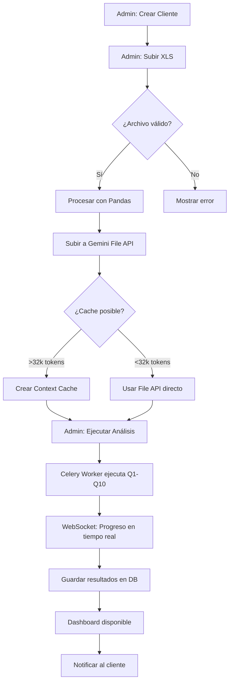
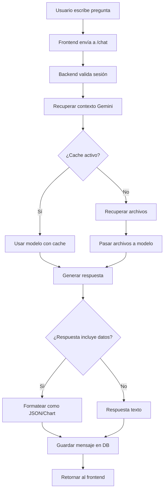

# 🎯 PIXELY PARTNERS - ESTADO IDEAL DEL SISTEMA

> Documento de Visión Arquitectónica y Funcional  
> Versión: 1.0 | Enero 2026

---

## 📋 ÍNDICE

1. [Visión General](#1-visión-general)
2. [Arquitectura Ideal](#2-arquitectura-ideal)
3. [Frontend - Experiencia de Usuario](#3-frontend---experiencia-de-usuario)
4. [Backend - Motor de Inteligencia](#4-backend---motor-de-inteligencia)
5. [Orquestador Semántico](#5-orquestador-semántico)
6. [Sistema de Análisis Q1-Q10](#6-sistema-de-análisis-q1-q10)
7. [Dashboard Ideal](#7-dashboard-ideal)
8. [Gestión de Usuarios y Roles](#8-gestión-de-usuarios-y-roles)
9. [Chatbot Semántico](#9-chatbot-semántico)
10. [Flujos de Trabajo Optimizados](#10-flujos-de-trabajo-optimizados)
11. [Integraciones](#11-integraciones)
12. [Seguridad y Compliance](#12-seguridad-y-compliance)
13. [Performance y Escalabilidad](#13-performance-y-escalabilidad)
14. [Experiencia Visual y Estética](#14-experiencia-visual-y-estética)

---

## 1. VISIÓN GENERAL

### 1.1 Propósito del Sistema

Pixely Partners es una **plataforma de inteligencia semántica** diseñada para transformar datos brutos de redes sociales, feedback de clientes y comunicaciones corporativas en **insights accionables** mediante análisis avanzado con IA (Google Gemini).

### 1.2 Usuarios Objetivo

| Rol | Necesidades | Acceso |
|-----|-------------|--------|
| **Admin (Pixely HQ)** | Gestión completa de clientes, usuarios, orquestación de análisis | Total |
| **Analista** | Ejecución de análisis, visualización de dashboards, chat con IA | Dashboards + Lab + Tareas |
| **Cliente** | Visualización de SUS datos únicamente, chat con su contexto | Solo su Dashboard + Chat |

### 1.3 Propuesta de Valor Diferencial

```
┌─────────────────────────────────────────────────────────────────────┐
│                     PIPELINE DE VALOR PIXELY                       │
├─────────────────────────────────────────────────────────────────────┤
│                                                                     │
│   📊 DATOS BRUTOS    →    🧠 GEMINI AI    →    💡 INSIGHTS         │
│   (Excel, CSV, PDF)       (Context Cache)       (Q1-Q10 Analysis)  │
│                                                                     │
│                              ↓                                      │
│                                                                     │
│   📈 VISUALIZACIÓN   ←    💬 CHATBOT     ←    📋 TAREAS            │
│   (Dashboard React)       (RAG Semántico)      (Action Items)      │
│                                                                     │
└─────────────────────────────────────────────────────────────────────┘
```

---

## 2. ARQUITECTURA IDEAL

### 2.1 Stack Tecnológico Óptimo

```
┌─────────────────────────────────────────────────────────────────────┐
│                        FRONTEND LAYER                               │
├─────────────────────────────────────────────────────────────────────┤
│  React 18 + TypeScript + Vite                                       │
│  TailwindCSS + Custom Design System (Pixely UI)                     │
│  Recharts + D3.js para visualizaciones avanzadas                    │
│  Zustand/Jotai para estado global (reemplazar Context API)          │
│  React Query (TanStack) para fetching y cache                       │
│  Framer Motion para animaciones fluidas                             │
└─────────────────────────────────────────────────────────────────────┘
                                 │
                                 ▼
┌─────────────────────────────────────────────────────────────────────┐
│                        API GATEWAY                                  │
├─────────────────────────────────────────────────────────────────────┤
│  NGINX con rate limiting, SSL termination                           │
│  WebSocket support para real-time updates                           │
│  CDN para assets estáticos (Cloudflare/Vercel Edge)                │
└─────────────────────────────────────────────────────────────────────┘
                                 │
                                 ▼
┌─────────────────────────────────────────────────────────────────────┐
│                        BACKEND LAYER                                │
├─────────────────────────────────────────────────────────────────────┤
│  FastAPI (async) con Pydantic v2                                    │
│  SQLAlchemy 2.0 + Alembic (migrations)                              │
│  Celery + Redis para tareas background (análisis largo)             │
│  JWT + OAuth2 con refresh tokens                                    │
└─────────────────────────────────────────────────────────────────────┘
                                 │
                                 ▼
┌─────────────────────────────────────────────────────────────────────┐
│                        DATA LAYER                                   │
├─────────────────────────────────────────────────────────────────────┤
│  PostgreSQL (Supabase) - Datos relacionales                         │
│  Redis - Cache de sesiones + Queue de trabajos                      │
│  S3/Supabase Storage - Archivos subidos                             │
│  Gemini Context Cache - Datos indexados para RAG                    │
└─────────────────────────────────────────────────────────────────────┘
                                 │
                                 ▼
┌─────────────────────────────────────────────────────────────────────┐
│                        AI/ML LAYER                                  │
├─────────────────────────────────────────────────────────────────────┤
│  Google Gemini 2.0 Flash (o superior) con Context Caching           │
│  Embeddings para búsqueda semántica (text-embedding-004)            │
│  Fallback a GPT-4 Turbo si Gemini falla                             │
└─────────────────────────────────────────────────────────────────────┘
```

### 2.2 Infraestructura de Despliegue Ideal

```yaml
# docker-compose.production.yml (IDEAL)
services:
  # Frontend (SSR opcional)
  frontend:
    build: ./frontend
    replicas: 2
    healthcheck:
      test: ["CMD", "curl", "-f", "http://localhost:3000/health"]
    
  # API Principal
  api:
    build: ./backend
    replicas: 3
    environment:
      - WORKERS=4
      - ASYNC_POOL_SIZE=20
    healthcheck:
      test: ["CMD", "curl", "-f", "http://localhost:8000/health"]
    
  # Worker para tareas pesadas
  worker:
    build: ./backend
    command: celery -A orchestrator.tasks worker -l INFO -c 4
    replicas: 2
    
  # Scheduler para tareas programadas
  scheduler:
    build: ./backend
    command: celery -A orchestrator.tasks beat -l INFO
    
  # Redis para queue y cache
  redis:
    image: redis:7-alpine
    volumes:
      - redis_data:/data
      
  # PostgreSQL (o usar Supabase managed)
  db:
    image: postgres:15-alpine
    volumes:
      - pg_data:/var/lib/postgresql/data
```

---

## 3. FRONTEND - EXPERIENCIA DE USUARIO

### 3.1 Estructura de Módulos Ideal

```
frontend/
├── src/
│   ├── app/                    # App shell y routing
│   │   ├── routes/
│   │   │   ├── dashboard/      # Vista principal
│   │   │   ├── lab/            # Análisis experimental
│   │   │   ├── partners/       # Gestión de clientes
│   │   │   ├── work/           # Tareas y seguimiento
│   │   │   ├── wiki/           # Documentación
│   │   │   └── admin/          # Panel administrativo
│   │   └── layout.tsx
│   │
│   ├── components/
│   │   ├── ui/                 # Componentes base (Button, Input, Modal)
│   │   ├── charts/             # Visualizaciones reutilizables
│   │   ├── cards/              # Tarjetas de información
│   │   └── layouts/            # Estructuras de página
│   │
│   ├── features/               # Lógica de negocio por feature
│   │   ├── auth/
│   │   ├── analysis/
│   │   ├── chat/
│   │   └── clients/
│   │
│   ├── hooks/                  # Custom hooks
│   ├── services/               # API calls
│   ├── stores/                 # Estado global (Zustand)
│   ├── types/                  # TypeScript types
│   └── utils/                  # Helpers
│
├── public/
└── package.json
```

### 3.2 Sistema de Navegación Ideal

```
┌──────────────────────────────────────────────────────────────────────┐
│                           SIDEBAR IDEAL                              │
├──────────────────────────────────────────────────────────────────────┤
│                                                                      │
│   ┌─────────┐                                                        │
│   │  LOGO   │  Pixely Partners                                       │
│   └─────────┘                                                        │
│                                                                      │
│   ━━━━━━━━━━━━━━━━━━━━━━━━━━━━━━━━━━━━━                              │
│                                                                      │
│   📊  Dashboard        ← Vista principal con KPIs                    │
│   🧪  Lab              ← Análisis Q1-Q10 detallado                   │
│   👥  Partners         ← Lista de clientes (Admin)                   │
│   📋  Tareas           ← Action items generados                      │
│   📚  Wiki             ← Documentación y guías                       │
│                                                                      │
│   ━━━━━━━━━━━━━━━━━━━━━━━━━━━━━━━━━━━━━                              │
│                                                                      │
│   🛡️  Admin            ← SOLO VISIBLE PARA ADMINS                    │
│                                                                      │
│   ━━━━━━━━━━━━━━━━━━━━━━━━━━━━━━━━━━━━━                              │
│                                                                      │
│   ┌─────────────────────────────────────┐                            │
│   │  👤 Usuario                         │                            │
│   │  admin@pixely.com                   │                            │
│   │  [🔴 Cerrar Sesión]                 │                            │
│   └─────────────────────────────────────┘                            │
│                                                                      │
└──────────────────────────────────────────────────────────────────────┘
```

### 3.3 Comportamiento de Roles en UI

| Elemento | Admin | Analyst | Client |
|----------|-------|---------|--------|
| Sidebar - Dashboard | ✅ | ✅ | ✅ (solo sus datos) |
| Sidebar - Lab | ✅ | ✅ | ❌ |
| Sidebar - Partners | ✅ | ❌ | ❌ |
| Sidebar - Tareas | ✅ | ✅ | ✅ (solo sus tareas) |
| Sidebar - Wiki | ✅ | ✅ | ✅ |
| Sidebar - Admin | ✅ | ❌ | ❌ |
| Ejecutar Análisis | ✅ | ✅ | ❌ |
| Crear Usuarios | ✅ | ❌ | ❌ |
| Crear Clientes | ✅ | ❌ | ❌ |
| Chat con IA | ✅ | ✅ | ✅ |
| Ver todos los clientes | ✅ | ✅ | ❌ |

---

## 4. BACKEND - MOTOR DE INTELIGENCIA

### 4.1 Estructura de Endpoints Ideal

```
/api/v1/
│
├── /auth/
│   ├── POST   /login          → JWT + refresh token
│   ├── POST   /logout         → Invalidar tokens
│   ├── POST   /refresh        → Renovar access token
│   └── GET    /me             → Usuario actual + permisos
│
├── /users/
│   ├── GET    /               → Listar usuarios (admin)
│   ├── POST   /               → Crear usuario (admin)
│   ├── GET    /{id}           → Detalle usuario
│   ├── PATCH  /{id}           → Actualizar usuario
│   └── DELETE /{id}           → Eliminar usuario (admin)
│
├── /clients/
│   ├── GET    /               → Listar clientes del tenant
│   ├── POST   /               → Crear cliente (admin)
│   ├── GET    /{id}           → Detalle cliente
│   ├── PATCH  /{id}           → Actualizar cliente
│   ├── DELETE /{id}           → Eliminar cliente (admin)
│   └── GET    /{id}/context   → Estado del contexto Gemini
│
├── /analysis/
│   ├── POST   /{client_id}/start     → Iniciar análisis (async)
│   ├── GET    /{client_id}/status    → Estado del análisis
│   ├── GET    /{client_id}/results   → Resultados completos
│   ├── GET    /{client_id}/q/{n}     → Resultado de Qn específico
│   └── POST   /{client_id}/refresh   → Re-ejecutar análisis
│
├── /ingest/
│   ├── POST   /{client_id}/upload    → Subir archivo
│   ├── GET    /{client_id}/files     → Listar archivos
│   ├── DELETE /{client_id}/files/{id}→ Eliminar archivo
│   └── POST   /{client_id}/rebuild   → Reconstruir contexto
│
├── /chat/
│   ├── GET    /{client_id}/sessions          → Listar sesiones
│   ├── POST   /{client_id}/sessions          → Nueva sesión
│   ├── GET    /sessions/{id}/messages        → Mensajes de sesión
│   ├── POST   /sessions/{id}/messages        → Enviar mensaje
│   └── DELETE /sessions/{id}                 → Eliminar sesión
│
├── /tasks/
│   ├── GET    /{client_id}/                  → Tareas del cliente
│   ├── POST   /{client_id}/                  → Crear tarea
│   ├── PATCH  /{id}                          → Actualizar tarea
│   └── DELETE /{id}                          → Eliminar tarea
│
└── /webhooks/
    ├── POST   /gemini/callback   → Callback de análisis async
    └── POST   /stripe/events     → Eventos de facturación
```

### 4.2 Sistema de Tareas Asíncronas (Ideal)

```python
# orchestrator/tasks.py (IDEAL)

from celery import Celery
from celery.signals import task_prerun, task_postrun

app = Celery('pixely', broker='redis://redis:6379/0')

@app.task(bind=True, max_retries=3, soft_time_limit=600)
def run_full_analysis(self, client_id: str, user_id: str):
    """
    Ejecuta análisis Q1-Q10 de forma asíncrona.
    Emite eventos de progreso vía WebSocket.
    """
    try:
        # Notificar inicio
        emit_progress(client_id, {"phase": "starting", "progress": 0})
        
        # Q1-Q9 en secuencia
        for i, (key, name) in enumerate(ANALYSIS_MODULES):
            emit_progress(client_id, {
                "phase": name,
                "progress": (i + 1) * 10,
                "current_module": key
            })
            result = run_single_analysis(client_id, key)
            save_result(client_id, key, result)
        
        # Q10 - Síntesis
        emit_progress(client_id, {"phase": "synthesizing", "progress": 95})
        synthesize_executive_summary(client_id)
        
        # Completado
        emit_progress(client_id, {"phase": "completed", "progress": 100})
        
    except Exception as e:
        emit_progress(client_id, {"phase": "error", "error": str(e)})
        self.retry(exc=e)
```

### 4.3 WebSocket para Progreso Real-Time

```python
# api/websockets.py (IDEAL)

from fastapi import WebSocket, WebSocketDisconnect
from typing import Dict, Set

class ConnectionManager:
    def __init__(self):
        self.active_connections: Dict[str, Set[WebSocket]] = {}
    
    async def connect(self, client_id: str, websocket: WebSocket):
        await websocket.accept()
        if client_id not in self.active_connections:
            self.active_connections[client_id] = set()
        self.active_connections[client_id].add(websocket)
    
    async def broadcast_progress(self, client_id: str, data: dict):
        """Envía progreso a todos los clientes suscritos"""
        if client_id in self.active_connections:
            for connection in self.active_connections[client_id]:
                await connection.send_json(data)

manager = ConnectionManager()

@router.websocket("/ws/analysis/{client_id}")
async def analysis_progress(websocket: WebSocket, client_id: str):
    await manager.connect(client_id, websocket)
    try:
        while True:
            await websocket.receive_text()  # Keep alive
    except WebSocketDisconnect:
        manager.disconnect(client_id, websocket)
```

---

## 5. ORQUESTADOR SEMÁNTICO

### 5.1 Flujo de Ingesta Ideal

```
┌─────────────────────────────────────────────────────────────────────┐
│                    FLUJO DE INGESTA OPTIMIZADO                      │
├─────────────────────────────────────────────────────────────────────┤
│                                                                     │
│   1. UPLOAD                                                         │
│   ┌─────────┐     ┌─────────────┐     ┌─────────────┐              │
│   │ Usuario │ ──→ │ Validación  │ ──→ │ S3/Storage  │              │
│   │ sube XLS│     │ (tipo, size)│     │ (persistir) │              │
│   └─────────┘     └─────────────┘     └─────────────┘              │
│                                              │                      │
│                                              ▼                      │
│   2. PROCESAMIENTO                                                  │
│   ┌─────────────┐     ┌─────────────┐     ┌─────────────┐          │
│   │ Extracción  │ ──→ │ Limpieza    │ ──→ │ Enriquecim. │          │
│   │ (pandas)    │     │ (NaN, dups) │     │ (metadata)  │          │
│   └─────────────┘     └─────────────┘     └─────────────┘          │
│                                              │                      │
│                                              ▼                      │
│   3. INDEXACIÓN EN GEMINI                                          │
│   ┌─────────────┐     ┌─────────────┐     ┌─────────────┐          │
│   │ File Upload │ ──→ │ Context     │ ──→ │ Cache       │          │
│   │ (File API)  │     │ Caching     │     │ Activo ✅   │          │
│   └─────────────┘     └─────────────┘     └─────────────┘          │
│                                                                     │
└─────────────────────────────────────────────────────────────────────┘
```

### 5.2 Gestión de Contexto Inteligente

```python
# orchestrator/context_manager.py (IDEAL)

class ContextManager:
    """
    Gestiona el ciclo de vida del contexto Gemini.
    - Combina múltiples archivos en un solo contexto
    - Maneja expiración y renovación automática
    - Fallback a File API si cache falla
    """
    
    CACHE_TTL_HOURS = 48  # Gemini cache dura hasta 48h
    MIN_TOKENS_FOR_CACHE = 32000
    
    async def ensure_valid_context(self, client_id: str) -> CachedContent:
        """
        Asegura que el cliente tiene un contexto válido.
        Si está expirado o inválido, lo regenera automáticamente.
        """
        context = await self.get_context(client_id)
        
        if not context or self._is_expired(context):
            logger.info(f"♻️ Regenerando contexto para {client_id}")
            return await self.rebuild_context(client_id)
        
        return context
    
    async def rebuild_context(self, client_id: str) -> CachedContent:
        """
        Reconstruye el contexto Gemini desde todos los archivos del cliente.
        """
        files = await self.get_client_files(client_id)
        
        if not files:
            raise NoContextError("No hay archivos para este cliente")
        
        # Combinar contenido de todos los archivos
        combined_content = await self._merge_files(files)
        
        # Crear cache en Gemini
        cache = await self._create_gemini_cache(
            content=combined_content,
            display_name=f"pixely-{client_id}",
            ttl=timedelta(hours=self.CACHE_TTL_HOURS)
        )
        
        # Guardar referencia en DB
        await self._save_context_reference(client_id, cache)
        
        return cache
```

---

## 6. SISTEMA DE ANÁLISIS Q1-Q10

### 6.1 Módulos de Análisis

| Módulo | Nombre | Framework Teórico | Output Principal |
|--------|--------|-------------------|------------------|
| **Q1** | Emociones | Rueda de Plutchik | 8 emociones + intensidad |
| **Q2** | Personalidad | Dimensiones de Aaker | 5 rasgos de marca |
| **Q3** | Tópicos | LDA + Clustering semántico | Top 10 temas |
| **Q4** | Marcos Narrativos | Framing de Entman | Distribución de frames |
| **Q5** | Influenciadores | Análisis de red social | Ranking de influencia |
| **Q6** | Oportunidades | Gap Analysis | Matriz de oportunidades |
| **Q7** | Sentimiento | VADER + Fine-tuned | Pos/Neg/Neu/Mix |
| **Q8** | Temporal | Time Series Analysis | Tendencias y anomalías |
| **Q9** | Recomendaciones | Priorización estratégica | Acciones ordenadas |
| **Q10** | Resumen Ejecutivo | Síntesis automática | KPIs + Alertas |

### 6.2 Prompts Optimizados (Ejemplo Q1)

```python
Q1_EMOTIONS_PROMPT = """
Eres un experto en análisis de sentimientos utilizando la Rueda de Emociones de Plutchik.

CONTEXTO:
- Los datos provienen de conversaciones en redes sociales sobre la marca.
- Cada fila representa una publicación/comentario con su engagement.

INSTRUCCIONES:
1. Analiza CADA publicación identificando las emociones primarias de Plutchik:
   - Alegría, Confianza, Miedo, Sorpresa, Tristeza, Disgusto, Ira, Anticipación
2. Asigna intensidad (0.0 a 1.0) basándote en:
   - Lenguaje utilizado
   - Contexto del mensaje
   - Indicadores de engagement (likes, shares)
3. Identifica emociones secundarias (combinaciones)

FORMATO DE RESPUESTA (JSON estricto):
{
  "analisis_por_publicacion": [
    {
      "id": "string",
      "texto_original": "string",
      "emociones": {
        "alegria": 0.8,
        "confianza": 0.6,
        ...
      },
      "emocion_dominante": "alegria",
      "intensidad_global": 0.75
    }
  ],
  "resumen_global_emociones": {
    "alegria": 0.45,
    "confianza": 0.30,
    ...
  },
  "insight": "La marca genera principalmente alegría y confianza..."
}
"""
```

### 6.3 Feedback de Progreso en UI (Ideal)

```tsx
// components/AnalysisProgress.tsx (IDEAL)

interface AnalysisProgressProps {
  clientId: string;
}

export const AnalysisProgress: React.FC<AnalysisProgressProps> = ({ clientId }) => {
  const [progress, setProgress] = useState(0);
  const [phase, setPhase] = useState('');
  const [currentModule, setCurrentModule] = useState('');
  
  // WebSocket connection for real-time updates
  useEffect(() => {
    const ws = new WebSocket(`ws://api/ws/analysis/${clientId}`);
    
    ws.onmessage = (event) => {
      const data = JSON.parse(event.data);
      setProgress(data.progress);
      setPhase(data.phase);
      setCurrentModule(data.current_module);
    };
    
    return () => ws.close();
  }, [clientId]);
  
  return (
    <div className="fixed inset-0 bg-black/50 flex items-center justify-center z-50">
      <div className="bg-white rounded-3xl p-8 w-[500px] shadow-2xl">
        
        {/* Header */}
        <div className="text-center mb-6">
          <div className="w-16 h-16 bg-primary-100 rounded-full flex items-center justify-center mx-auto mb-4">
            <Brain className="text-primary-500 animate-pulse" size={32} />
          </div>
          <h2 className="text-xl font-bold">Análisis en Progreso</h2>
          <p className="text-gray-500 text-sm">{phase}</p>
        </div>
        
        {/* Progress Bar */}
        <div className="mb-6">
          <div className="h-3 bg-gray-100 rounded-full overflow-hidden">
            <div 
              className="h-full bg-gradient-to-r from-primary-400 to-primary-600 transition-all duration-500"
              style={{ width: `${progress}%` }}
            />
          </div>
          <div className="flex justify-between mt-2 text-xs text-gray-500">
            <span>{currentModule}</span>
            <span>{progress}%</span>
          </div>
        </div>
        
        {/* Module Progress */}
        <div className="grid grid-cols-5 gap-2">
          {['Q1','Q2','Q3','Q4','Q5','Q6','Q7','Q8','Q9','Q10'].map((q, i) => (
            <div 
              key={q}
              className={`
                h-8 rounded-lg flex items-center justify-center text-xs font-bold
                ${i < Math.floor(progress / 10) 
                  ? 'bg-primary-500 text-white' 
                  : i === Math.floor(progress / 10)
                    ? 'bg-primary-200 text-primary-700 animate-pulse'
                    : 'bg-gray-100 text-gray-400'
                }
              `}
            >
              {q}
            </div>
          ))}
        </div>
        
      </div>
    </div>
  );
};
```

---

## 7. DASHBOARD IDEAL

### 7.1 Layout del Dashboard

```
┌─────────────────────────────────────────────────────────────────────────────┐
│                              DASHBOARD IDEAL                                 │
├─────────────────────────────────────────────────────────────────────────────┤
│                                                                             │
│  ┌─────────────────────────────────────────────────────────────────────┐   │
│  │                    HEADER BAR                                        │   │
│  │  📊 Dashboard   [Cliente: ACME Corp ▼]   [Período: Último Mes ▼]    │   │
│  └─────────────────────────────────────────────────────────────────────┘   │
│                                                                             │
│  ┌─────────────────────┐  ┌─────────────────────┐  ┌─────────────────────┐ │
│  │    KPI CARD 1       │  │    KPI CARD 2       │  │    KPI CARD 3       │ │
│  │  📈 Sentiment Score │  │  🎯 Engagement Rate │  │  👥 Reach Total     │ │
│  │      78.5%          │  │       4.2%          │  │      1.2M           │ │
│  │   ▲ +5.2% vs prev   │  │   ▼ -0.8% vs prev  │  │   ▲ +15% vs prev    │ │
│  └─────────────────────┘  └─────────────────────┘  └─────────────────────┘ │
│                                                                             │
│  ┌───────────────────────────────────┐  ┌───────────────────────────────┐  │
│  │         EMOCIONES (Q1)            │  │      PERSONALIDAD (Q2)        │  │
│  │                                   │  │                               │  │
│  │    [Radar Chart Plutchik]         │  │    [Spider Chart Aaker]       │  │
│  │                                   │  │                               │  │
│  │   🔄 Flip para detalle            │  │   🔄 Flip para detalle        │  │
│  └───────────────────────────────────┘  └───────────────────────────────┘  │
│                                                                             │
│  ┌───────────────────────────────────┐  ┌───────────────────────────────┐  │
│  │        TÓPICOS (Q3)               │  │    SENTIMIENTO (Q7)           │  │
│  │                                   │  │                               │  │
│  │   [Treemap / Bubble Chart]        │  │    [Horizontal Bars]          │  │
│  │                                   │  │    Positivo ████████░░ 78%    │  │
│  │                                   │  │    Negativo ██░░░░░░░░ 12%    │  │
│  │                                   │  │    Neutral  █░░░░░░░░░ 8%     │  │
│  │                                   │  │    Mixto    ░░░░░░░░░░ 2%     │  │
│  └───────────────────────────────────┘  └───────────────────────────────┘  │
│                                                                             │
│  ┌─────────────────────────────────────────────────────────────────────┐   │
│  │                    TENDENCIA TEMPORAL (Q8)                          │   │
│  │                                                                     │   │
│  │   [Line Chart - Sentiment over Time]                                │   │
│  │                                                                     │   │
│  │   ▓▓▓░░░░░░░░░░░░░░░░░░░░░░░░░░░░░░░░░░░░░░░░░░░░░░░░░░░░░░░░░░▓▓ │   │
│  │   Ene   Feb   Mar   Abr   May   Jun   Jul   Ago   Sep   Oct   Nov   │   │
│  └─────────────────────────────────────────────────────────────────────┘   │
│                                                                             │
│  ┌─────────────────────────────────────────────────────────────────────┐   │
│  │                    RESUMEN EJECUTIVO (Q10)                          │   │
│  │                                                                     │   │
│  │   🔴 ALERTA: Detectada tendencia negativa en tema "Servicio"        │   │
│  │                                                                     │   │
│  │   📌 Hallazgos Clave:                                               │   │
│  │   • La emoción dominante es CONFIANZA (45%)                         │   │
│  │   • El tema "Producto" genera el mayor engagement                   │   │
│  │   • Oportunidad identificada: Colaboración con @influencer_x        │   │
│  │                                                                     │   │
│  │   ⏱️ Acciones Urgentes (48h):                                       │   │
│  │   [✓] Responder comentarios negativos sobre envíos                  │   │
│  │   [✓] Contactar a micro-influencer detectado                        │   │
│  └─────────────────────────────────────────────────────────────────────┘   │
│                                                                             │
└─────────────────────────────────────────────────────────────────────────────┘
```

### 7.2 Características de las Tarjetas

```tsx
// Características ideales de cada Card
interface IdealCardFeatures {
  // Interactividad
  flip: boolean;           // ¿Se puede voltear para ver detalle?
  hover: 'glow' | 'lift';  // Efecto hover
  clickToExpand: boolean;  // ¿Se expande a modal?
  
  // Datos
  heroMetric: string;      // Número grande principal
  trend: {                 // Tendencia vs período anterior
    value: number;
    direction: 'up' | 'down' | 'stable';
  };
  sparkline?: number[];    // Mini gráfico de tendencia
  
  // Visualización
  chartType: 'bar' | 'line' | 'radar' | 'pie' | 'treemap' | 'heatmap';
  colorScheme: string[];
  
  // Acciones
  exportable: boolean;     // ¿Se puede exportar como imagen/CSV?
  shareable: boolean;      // ¿Se puede compartir link directo?
}
```

---

## 8. GESTIÓN DE USUARIOS Y ROLES

### 8.1 Modelo de Permisos Ideal

```typescript
// types/permissions.ts (IDEAL)

export type Role = 'admin' | 'analyst' | 'client';

export interface Permission {
  resource: string;
  actions: ('create' | 'read' | 'update' | 'delete')[];
}

export const ROLE_PERMISSIONS: Record<Role, Permission[]> = {
  admin: [
    { resource: 'users', actions: ['create', 'read', 'update', 'delete'] },
    { resource: 'clients', actions: ['create', 'read', 'update', 'delete'] },
    { resource: 'analysis', actions: ['create', 'read', 'update', 'delete'] },
    { resource: 'chat', actions: ['create', 'read', 'update', 'delete'] },
    { resource: 'tasks', actions: ['create', 'read', 'update', 'delete'] },
    { resource: 'admin_panel', actions: ['read'] },
  ],
  analyst: [
    { resource: 'clients', actions: ['read'] },
    { resource: 'analysis', actions: ['create', 'read'] },
    { resource: 'chat', actions: ['create', 'read'] },
    { resource: 'tasks', actions: ['create', 'read', 'update'] },
  ],
  client: [
    { resource: 'analysis', actions: ['read'] },  // Solo sus datos
    { resource: 'chat', actions: ['create', 'read'] },
    { resource: 'tasks', actions: ['read', 'update'] },  // Solo sus tareas
  ],
};
```

### 8.2 Onboarding de Clientes

```
┌─────────────────────────────────────────────────────────────────────┐
│                    FLUJO DE ONBOARDING IDEAL                        │
├─────────────────────────────────────────────────────────────────────┤
│                                                                     │
│   1. Admin crea FichaCliente                                        │
│      └── brand_name, industry, logo                                 │
│                                                                     │
│   2. Admin crea Usuario para el cliente                             │
│      └── email, password, role='client', ficha_cliente_id           │
│                                                                     │
│   3. Sistema envía email de bienvenida                              │
│      └── Credenciales + Link de acceso                              │
│                                                                     │
│   4. Admin sube archivos de contexto (XLS)                          │
│      └── Datos de redes sociales, encuestas, etc.                   │
│                                                                     │
│   5. Admin ejecuta análisis Q1-Q10                                  │
│      └── Genera insights iniciales                                  │
│                                                                     │
│   6. Cliente accede y ve SU dashboard                               │
│      └── Solo sus datos, puede chatear con el contexto              │
│                                                                     │
└─────────────────────────────────────────────────────────────────────┘
```

---

## 9. CHATBOT SEMÁNTICO

### 9.1 Características del Chat Ideal

```
┌─────────────────────────────────────────────────────────────────────┐
│                      CHATBOT PIXELY IDEAL                           │
├─────────────────────────────────────────────────────────────────────┤
│                                                                     │
│   📌 CAPACIDADES:                                                   │
│                                                                     │
│   ✅ Responde preguntas sobre los datos del cliente                 │
│   ✅ Genera gráficos on-demand                                      │
│   ✅ Exporta tablas como CSV                                        │
│   ✅ Sugiere acciones basadas en insights                           │
│   ✅ Mantiene contexto de conversación                              │
│   ✅ Permite drill-down en temas específicos                        │
│                                                                     │
│   📌 EJEMPLOS DE PROMPTS:                                           │
│                                                                     │
│   "¿Cuál fue el tema más mencionado la semana pasada?"              │
│   "Genera un gráfico de sentimiento por día"                        │
│   "¿Qué influencers mencionaron nuestra marca?"                     │
│   "Lista las 5 quejas más frecuentes"                               │
│   "Compara el engagement de Instagram vs Twitter"                   │
│                                                                     │
│   📌 MODOS:                                                         │
│                                                                     │
│   💬 Chat Normal    → Respuestas conversacionales                   │
│   📊 Modo Analista  → Respuestas con datos estructurados            │
│   📈 Modo Gráfico   → Genera visualizaciones                        │
│                                                                     │
└─────────────────────────────────────────────────────────────────────┘
```

### 9.2 UI del Chat

```tsx
// Estructura ideal del chat
<ChatContainer>
  {/* Header */}
  <ChatHeader>
    <ClientSelector />
    <ModeToggle modes={['chat', 'analyst', 'chart']} />
  </ChatHeader>
  
  {/* Sessions Sidebar */}
  <SessionsList>
    {sessions.map(s => <SessionItem key={s.id} {...s} />)}
    <NewSessionButton />
  </SessionsList>
  
  {/* Messages Area */}
  <MessagesArea>
    {messages.map(m => (
      <Message key={m.id} role={m.role}>
        {m.role === 'assistant' && m.chart && (
          <EmbeddedChart data={m.chart} />
        )}
        {m.role === 'assistant' && m.table && (
          <DataTable data={m.table} exportable />
        )}
        <MarkdownContent>{m.content}</MarkdownContent>
      </Message>
    ))}
  </MessagesArea>
  
  {/* Input */}
  <ChatInput 
    onSend={handleSend}
    suggestions={contextualSuggestions}
    attachments // Permitir adjuntar archivos
  />
</ChatContainer>
```

---

## 10. FLUJOS DE TRABAJO OPTIMIZADOS

### 10.1 Flujo de Análisis Nuevo Cliente



### 10.2 Flujo de Chat con Contexto



---

## 11. INTEGRACIONES

### 11.1 Integraciones Prioritarias

| Integración | Prioridad | Descripción |
|-------------|-----------|-------------|
| **Google Sheets** | Alta | Sincronizar datos automáticamente |
| **Slack** | Alta | Notificaciones y alertas |
| **Zapier** | Media | Conectar con 5000+ apps |
| **Metricool API** | Media | Importar métricas de RRSS |
| **HubSpot** | Baja | Sincronizar con CRM |
| **Notion** | Baja | Exportar reportes |

### 11.2 Webhook System

```python
# webhooks/manager.py (IDEAL)

class WebhookManager:
    async def trigger(self, event_type: str, payload: dict):
        """
        Dispara webhooks configurados para un tipo de evento.
        """
        webhooks = await self.get_webhooks_for_event(event_type)
        
        for wh in webhooks:
            await self.send_webhook(wh.url, {
                "event": event_type,
                "timestamp": datetime.utcnow().isoformat(),
                "payload": payload
            })

# Eventos disponibles
WEBHOOK_EVENTS = [
    "analysis.started",
    "analysis.completed",
    "analysis.failed",
    "alert.triggered",
    "task.created",
    "chat.message.received",
]
```

---

## 12. SEGURIDAD Y COMPLIANCE

### 12.1 Checklist de Seguridad

```
✅ Autenticación
   └── JWT con refresh tokens (access: 15min, refresh: 7d)
   └── Bcrypt para passwords (cost factor: 12)
   └── MFA opcional para admins

✅ Autorización
   └── RBAC (Role-Based Access Control)
   └── Row-Level Security en Supabase
   └── Validación de tenant_id en cada request

✅ Datos en Tránsito
   └── TLS 1.3 obligatorio
   └── HSTS headers
   └── Certificate pinning en mobile (futuro)

✅ Datos en Reposo
   └── Encriptación AES-256 en DB
   └── Secrets en environment variables
   └── No logs de datos sensibles

✅ API Security
   └── Rate limiting (100 req/min por usuario)
   └── CORS configurado correctamente
   └── Input validation con Pydantic
   └── SQL injection prevention (SQLAlchemy ORM)

✅ Compliance
   └── GDPR: Derecho al olvido implementado
   └── Data retention policies (90 días default)
   └── Audit logs de acciones críticas
```

### 12.2 Audit Logging

```python
# middleware/audit.py (IDEAL)

class AuditMiddleware:
    async def __call__(self, request: Request, call_next):
        # Capturar info pre-request
        start_time = time.time()
        user = await get_current_user_from_request(request)
        
        response = await call_next(request)
        
        # Log después de la respuesta
        if self._should_audit(request.method, request.url.path):
            await self.log_action({
                "timestamp": datetime.utcnow(),
                "user_id": user.id if user else None,
                "action": f"{request.method} {request.url.path}",
                "ip_address": request.client.host,
                "user_agent": request.headers.get("user-agent"),
                "response_status": response.status_code,
                "duration_ms": (time.time() - start_time) * 1000
            })
        
        return response
```

---

## 13. PERFORMANCE Y ESCALABILIDAD

### 13.1 Métricas Objetivo

| Métrica | Target | Actual |
|---------|--------|--------|
| Time to First Byte (TTFB) | < 200ms | ~300ms |
| API Response Time (p95) | < 500ms | ~800ms |
| Dashboard Load Time | < 2s | ~3s |
| Analysis Time (Q1-Q10) | < 5min | ~8min |
| Concurrent Users | 1000+ | ~100 |

### 13.2 Estrategias de Optimización

```
┌─────────────────────────────────────────────────────────────────────┐
│                    OPTIMIZACIONES RECOMENDADAS                      │
├─────────────────────────────────────────────────────────────────────┤
│                                                                     │
│   🚀 FRONTEND                                                       │
│   ├── Code splitting por ruta                                       │
│   ├── Lazy loading de componentes pesados                           │
│   ├── Image optimization (WebP, lazy load)                          │
│   ├── Service Worker para cache de assets                           │
│   └── React Query para cache de API calls                           │
│                                                                     │
│   🚀 BACKEND                                                        │
│   ├── Connection pooling (SQLAlchemy async)                         │
│   ├── Redis cache para queries frecuentes                           │
│   ├── Gzip compression                                              │
│   ├── Database indexes optimizados                                  │
│   └── Async/await en todas las operaciones I/O                      │
│                                                                     │
│   🚀 INFRAESTRUCTURA                                                │
│   ├── CDN para assets (Cloudflare)                                  │
│   ├── Auto-scaling de workers                                       │
│   ├── Database read replicas                                        │
│   └── Geographic distribution (multi-region)                        │
│                                                                     │
└─────────────────────────────────────────────────────────────────────┘
```

---

## 14. EXPERIENCIA VISUAL Y ESTÉTICA

### 14.1 Design System Pixely

```css
/* Design Tokens Ideales */

:root {
  /* Primary Colors */
  --color-primary-50: #f0f9ff;
  --color-primary-100: #e0f2fe;
  --color-primary-500: #0ea5e9;
  --color-primary-600: #0284c7;
  --color-primary-900: #0c4a6e;
  
  /* Brand */
  --color-brand-dark: #1a1a2e;
  --color-brand-accent: #8b5cf6;
  
  /* Chart Palette (Armonía cromática) */
  --chart-blue: #3b82f6;
  --chart-green: #10b981;
  --chart-yellow: #f59e0b;
  --chart-red: #ef4444;
  --chart-purple: #8b5cf6;
  --chart-pink: #ec4899;
  --chart-cyan: #06b6d4;
  --chart-orange: #f97316;
  
  /* Spacing Scale */
  --space-1: 0.25rem;
  --space-2: 0.5rem;
  --space-3: 0.75rem;
  --space-4: 1rem;
  --space-6: 1.5rem;
  --space-8: 2rem;
  --space-12: 3rem;
  
  /* Border Radius */
  --radius-sm: 0.5rem;
  --radius-md: 1rem;
  --radius-lg: 1.5rem;
  --radius-xl: 2rem;
  --radius-2xl: 2.5rem;
  
  /* Shadows */
  --shadow-card: 0 4px 6px -1px rgb(0 0 0 / 0.1);
  --shadow-card-hover: 0 10px 15px -3px rgb(0 0 0 / 0.1);
  --shadow-glow: 0 0 20px rgb(14 165 233 / 0.3);
  
  /* Typography */
  --font-sans: 'Inter', system-ui, sans-serif;
  --font-display: 'Cal Sans', 'Inter', sans-serif;
}
```

### 14.2 Principios de Diseño

```
┌─────────────────────────────────────────────────────────────────────┐
│                    PRINCIPIOS DE DISEÑO PIXELY                      │
├─────────────────────────────────────────────────────────────────────┤
│                                                                     │
│   1️⃣ CLARIDAD                                                       │
│      └── Jerarquía visual clara                                     │
│      └── Un solo CTA principal por pantalla                         │
│      └── Textos concisos y accionables                              │
│                                                                     │
│   2️⃣ CONSISTENCIA                                                   │
│      └── Mismos patrones de interacción                             │
│      └── Iconografía unificada (Lucide)                             │
│      └── Colores con significado constante                          │
│                                                                     │
│   3️⃣ EFICIENCIA                                                     │
│      └── Información más importante arriba-izquierda               │
│      └── Atajos de teclado para power users                         │
│      └── Acciones frecuentes accesibles en 1 click                  │
│                                                                     │
│   4️⃣ FEEDBACK                                                       │
│      └── Estados de carga siempre visibles                          │
│      └── Confirmación de acciones destructivas                      │
│      └── Mensajes de error claros y accionables                     │
│                                                                     │
│   5️⃣ DELICIA                                                        │
│      └── Microinteracciones suaves                                  │
│      └── Animaciones con propósito                                  │
│      └── Easter eggs para usuarios frecuentes                       │
│                                                                     │
└─────────────────────────────────────────────────────────────────────┘
```

### 14.3 Animaciones y Transiciones

```tsx
// Configuración de Framer Motion ideal
const cardVariants = {
  initial: { 
    opacity: 0, 
    y: 20,
    scale: 0.95 
  },
  animate: { 
    opacity: 1, 
    y: 0,
    scale: 1,
    transition: {
      duration: 0.4,
      ease: [0.25, 0.46, 0.45, 0.94] // Custom easing
    }
  },
  hover: {
    y: -4,
    boxShadow: "0 20px 40px -10px rgba(0,0,0,0.15)",
    transition: { duration: 0.2 }
  },
  tap: {
    scale: 0.98
  }
};

// Flip card animation
const flipVariants = {
  front: { rotateY: 0 },
  back: { rotateY: 180 }
};
```

---

## 📋 RESUMEN DE PRIORIDADES

### Mejoras Críticas (Sprint 1-2)

1. ✅ **Ocultar Admin para no-admins** — IMPLEMENTADO
2. ⏳ **WebSocket para progreso de análisis** — Pendiente
3. ⏳ **Refresh tokens** — Pendiente
4. ⏳ **Cache Redis para queries** — Pendiente

### Mejoras Importantes (Sprint 3-4)

5. ⏳ Celery para tareas background
6. ⏳ Export de datos (CSV, PDF)
7. ⏳ Notificaciones email
8. ⏳ Filtros avanzados en Dashboard

### Mejoras Deseables (Sprint 5+)

9. ⏳ MFA para admins
10. ⏳ Integración Slack
11. ⏳ Mobile responsive completo
12. ⏳ Dark mode

---

## 🎯 CONCLUSIÓN

Este documento describe el **estado ideal** de Pixely Partners. Cada sección representa el objetivo a alcanzar para tener un sistema:

- **100% funcional**: Todas las features críticas implementadas
- **Seguro**: Autenticación robusta, datos protegidos
- **Escalable**: Arquitectura preparada para crecimiento
- **Estético**: UI/UX de nivel profesional
- **Mantenible**: Código limpio y bien documentado

El camino desde el estado actual hacia este ideal debe ser **incremental**, priorizando las mejoras que más impacto tengan en los usuarios finales.

---

*Documento generado: Enero 2026*  
*Autor: Pixely Engineering Team*
